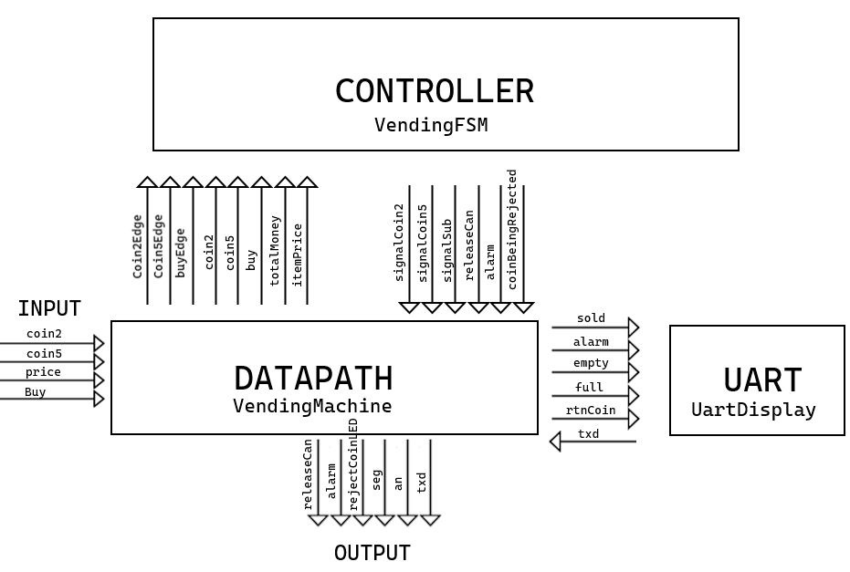
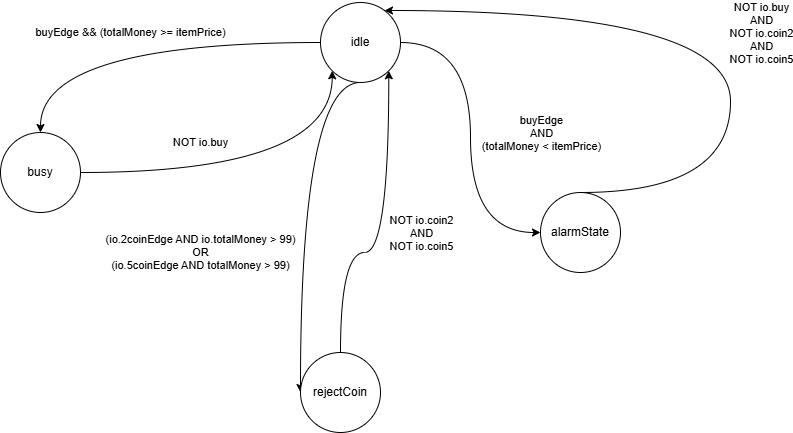
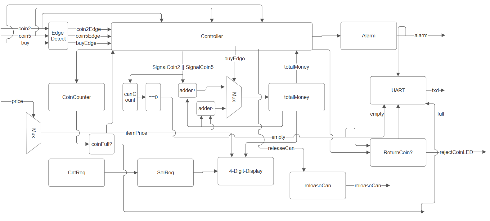
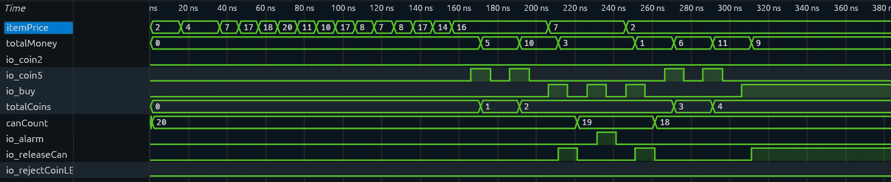
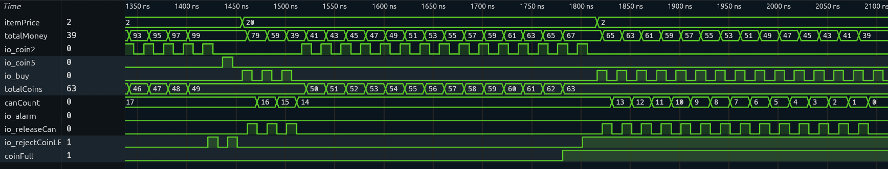
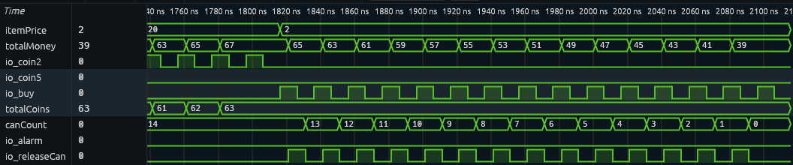

<embed src="root/small_logo.pdf" style="width:20.0%" /> \

------------------------------------------------------------------------

02139 Digital Eletronics II\
**Vending Machine Project**

------------------------------------------------------------------------

Mikkel Emil Hjorth Sørensen - s255917\
Christian Emil Mohr Bentzen - s255747

2026-05-27

# Abstract

This report presents the design, implementation, and hardware verification of a custom vending machine controller using a Finite State Machine with Datapath (FSMD) architecture. The digital design was modeled in Chisel  and deployed on a Basys 3 FPGA board . Controlled by a 4 state system, it manages external coin and buy inputs and monitors the users balance against variable switch-configured item prices. In order to go beyond the basic implementation, extensions such as a maximum 20-unit inventory system, a coin-vault overflow safety capping coins at 63, and text messages (EMPTY and FULL) being shown when occurring were included. A serial UART block was also implemented to transmit logs to an external terminal to use for technicians to review errors and bugs. The architecture was confirmed and validated through testbench simulations and synthesized within Xilinx Vivado to demonstrate on the Basys 3 FPGA board.

# Preface

The following list is a list of implementations and contributions, if we both worked on something, we gave an approximate split along with a short description of which parts we each did.

1.  Basic Vending machine: Christian: 50% / Mikkel: 50%\
    Both designed the basic Vending Maching together.

2.  FSM logic: Christian 80% / Mikkel 20%\
    Christian did the basic logic for state switching, along with Mikkel.

3.  Datapath coin update on fsm authorization: Christian 80% / Mikkel 20%\
    Christian did the basic coin and money update on the fsm authorization.

4.  4-digit display logic: Christian 40% / Mikkel 60%\
    Mikkel implemented the basic design and Christian updated to blink and show messages, along with alarm connection to the display. Mikkel connected "FULL" and "EPty" messages.

5.  Edge Detection: Christian 100% / Mikkel 0%

6.  Price Decoding: Christian 0% / Mikkel 100%

7.  Alarm and releaseCoinLED logic: Christian 20% / Mikkel 80%\
    Mikkel made the alarm system and the releaseCoinLED logic, Christian connected the alarm to 4-digit-display and to the fsm.

8.  Inventory system (Coins and Cans): Christian 20% / Mikkel 80%\
    Mikkel did the creation of the inventory system and logic behind it. Christian did connections between the limits and fsm.

9.  UART: Christian 20% / Mikkel 80%\
    Mikkel did the UART with inputs from Christian.

10. TestBench: Christian 80% / Mikkel 20%\
    Mikkel helped finding what to test for, Christian made the testbench, along with inputs from Mikkel.

# Introduction

Modern digital systems often rely on having the control flow and the mathematical execution of a system separated. This architecture is called a Finite State Machine with Datapath (FSMD). An FSMD divides the hardware into specialized registers that do the heavy mathematical work (the datapath), which is then controlled by the sequential control logic (the FSM). In our project we have worked with this design structure and made a coin-and-button operated vending machine based on this. This report will document how the design, hardware implementation and verification using tests operated on a complex vending machine controller. The project is written in Chisel, and is primarily to be used for synthesis on a Xilinx Basys 3 FPGA board, which will manage the asynchronous user inputs, the mathematical operations and sequence state transitions. The main aspect of the problem is handling and tracking user input currencies (2 kr. and 5 kr.) and matching the balance to what the user is trying to do. The information displayed by the controller is put on a seven-segment display, and confirmation of the users actions will be sent to a terminal using UART.\
More specifically, this project includes:

- Input of currencies (2. kr and 5kr.)

- Buying of items (if possible)

- Seven-segment display showing price and error messages

- Handling of overstocking machines coin and can compartments

- LED’s to display errors or incoming rejected coins

- UART to display Vending Machine operations to technicians

The following sections of this report will show the state behaviors, the block diagram, the actual code and test bench.

# Analysis and Design

As stated, the design of the vending machine controller follows a Finite State Machine with Datapath (FSMD) architecture. This means that the digital system has been split into two sections, each specializing on their own part.

- **The Datapath:** Contains hardware registers, arithmetic units (adders, subtractors), edge detectors. It is the muscle of the system.

- **The Control Path (FSM):** Implemented using a sequential state machine that changes based on edge-triggered signals and evaluates the financial states and sends information back to the datapath. This is the brain of the system.

The division is useful since it minimizes resource usage by only using what is actually necessary at a given point. It also handles error states efficiently and makes sure that nothing else happens before an error is resolved. An example could be that if the coin compartment is filled, you will not be allowed to put more coins in, but you may still use the ones you have as long as there are drinks left in the machine.

## Overview of registers

| Register | Type | Reset Value | Purpose |
|:--:|:--:|:--:|:---|
| totalMoney | UInt(8.W) | 0.U | Tracks the balance of the active user |
| coin2Count | UInt(6.W) | 0.U | Used to track how many 2 kr. there are |
| coin5Count | UInt(6.W) | 0.U | Used to track how many 5 kr. there are |
| canCount | UInt(5.W) | 20.U | Used to track how many cans there are |
| fullDisplayCount | UInt(4.W) | 0.U | Used for mapping dispaly when for FULL warning |
| rejectReg | Bool | true.B | Used for LED toggling to show coin rejection |
| rejectCounter | UInt(32.W) | 0.U | Used for LED blinking to show coin rejection |
| blinkReg | Bool | true.B | Used for LED toggling for alarm state |
| blinkCounter | UInt(32.W) | 0.U | Used for LED blinking to show alarm state |
| cntReg | UInt(32.W) | 0.U | Used for seven segment display operation |
| selReg | UInt(2.W) | 0.U | Used for switching which 7-segment anode is enabled |

## Financial and Inventory Mathematics

The system uses the datapath to handle the financial and inventory aspects of the operations. Whenever a positive edge on a clock signal is given, the next state of totalMoney updates based on signals send by the control FSM:

- **When** `fsm.io.signalCoin2` **is active:** `totalMoney` increments by 2 kr.

- **When** `fsm.io.signalCoin5` **is active:** `totalMoney` increments by 5 kr.

- **When** `fsm.io.signalSub` **is active:** `totalMoney` decrements by the current `itemPrice`.

- **Under all other conditions:** `totalMoney` keeps its current value.

The inventory is handled simultaneously, and the coin vault registers are updated on the same clock edge.

- `coin2Count` increments by 1 if `fsm.io.signalCoin2` is true.

- `coin5Count` increments by 1 if `fsm.io.signalCoin5` is true.

The stock tracking of the inventory is handled in a specific manner to make sure double-subtraction doesn’t occur, and it only decreases by 1 unit on a given clock cycle.

- `canCount` decrements by 1 when `buyFallingEdge` is true, and `canEmpty` is false.

## Item Price Decoder

The item price is implemented using a lookup decoder that maps the 4 bit physical hardware switch `io.price` to and 8-bit price value `itemPrice`.

<table>
<thead>
<tr>
<th style="text-align: center;">Switch Value</th>
<th style="text-align: center;">itemPrice</th>
<th style="text-align: center;">Sold Item</th>
</tr>
</thead>
<tbody>
<tr>
<td style="text-align: center;">0</td>
<td style="text-align: center;">2 kr.</td>
<td style="text-align: center;">Water Bottle</td>
</tr>
<tr>
<td style="text-align: center;">1 or 2</td>
<td style="text-align: center;">4 kr.</td>
<td style="text-align: center;">Coca-Cola or Faxe Kondi Can (sale)</td>
</tr>
<tr>
<td style="text-align: center;">3 or 11</td>
<td style="text-align: center;">7 kr.</td>
<td style="text-align: center;">Pepsi Can or Carlsberg Beer (Small)</td>
</tr>
<tr>
<td style="text-align: center;">4 or 9 or 13</td>
<td style="text-align: center;">17 kr.</td>
<td style="text-align: center;">Coca-Cola Bottle or Booster Energy or Heineken Beer (Large)</td>
</tr>
<tr>
<td style="text-align: center;">5</td>
<td style="text-align: center;">18 kr.</td>
<td style="text-align: center;">Faxe Kondi Bottle</td>
</tr>
<tr>
<td style="text-align: center;">6</td>
<td style="text-align: center;">20 kr.</td>
<td style="text-align: center;">Pepsi Bottle</td>
</tr>
<tr>
<td style="text-align: center;">7</td>
<td style="text-align: center;">11 kr.</td>
<td style="text-align: center;">Monster Energy (sale)</td>
</tr>
<tr>
<td style="text-align: center;">8</td>
<td style="text-align: center;">10 kr.</td>
<td style="text-align: center;">Red Bull (sale)</td>
</tr>
<tr>
<td style="text-align: center;">10 or 12</td>
<td style="text-align: center;">8 kr.</td>
<td style="text-align: center;">Heineken Beer (Small) or Tuborg Classic Beer (small)</td>
</tr>
<tr>
<td style="text-align: center;">14</td>
<td style="text-align: center;">14 kr.</td>
<td style="text-align: center;">Carlsberg Beer (Large)</td>
</tr>
<tr>
<td style="text-align: center;">15</td>
<td style="text-align: center;">16 kr.</td>
<td style="text-align: center;">Tuborg Classic Beer (Large)</td>
</tr>
<tr>
<td colspan="3" style="text-align: center;"><strong>All other switch combinations: <code>itemPrice</code> will be 0 kr.</strong></td>
</tr>
</tbody>
</table>

This will be used for the seven-segment display rendering, where we change the 8-bit binary value into a base-10 value to be used to dispaly.

- `priceOnes = itemPrice` % 10

- `priceTens = (itemPrice` / 10) % 10

## Inputs and Edge-Detection

The system must implement edge-detection, since a button will be held down for millions of clock cycles. In order for this to work, we implement a rising edge detector that checks if the current input is high while the previous clock cycle was low. This isolates a long human button press down to a single clock cycle, ensuring the machine only registers one action per press and preventing continuous mathematical overflows.

- `risingEdge = currentInput` AND (NOT `previousInput`)

We used this function (we defined it) to make the edges for our coin2, coin5, and buy inputs.

- `coin2Edge = risingEdge(io.coin2)` AND (NOT `canEmpty`) AND (NOT `coinFull`)

- `coin5Edge = risingEdge(io.coin5)` AND (NOT `canEmpty`) AND (NOT `coinFull`)

- `buyEdge = risingEdge(io.buy)` AND (NOT `canEmpty`)

## Control Path Architecture

The controller is governed entirely by the VendingFSM module (see [Appendix B](#sec:app_fsm) The FSM has 4 states:

- `idle:` The primary state. It checks for input edges and sends signals to the datapath about updates to the registers, and sends the system to the next state.

- `busy:` The busy state is used to make sure the LED stays on when the buy button is held, otherwise it goes back to idle. The state is reached by having enough money and trying to buy something. A signal is sent to UART upon a succesfull purchase.

- `rejectCoin:` This state is used as a overflow safety. If a coin is being inserted that will take the value of all coins to 99, machine will stop it and flash an LED and send a signal to UART.

- `alarmState:` This state is achieved when a user tries to buy something, but they don’t have the money for it. It will flash an LED as well as the seven-segment display, and also send a message to the UART while the buy button is held.

## Seven-Segment Display Overrides

The seven-segment display will show the value of the items using the logic that was previously shown for the price of the item. The total money handled the same way.

- `onesDigit = totalMoney` % 10

- `tensDigit = (totalMoney` / 10) % 10

The seven-segment display can be overwritten in 2 different ways. The first way is during the alarm state of the FSM, a 2:1 Multiplexer is used to set the anode to be off completely, otherwise it will show the actual number. This makes it blink since this is only achieved whenever the blinkReg register blinks, and therefore all the numbers are as they should, then off, then back, meaning they blink. The other time it will be overwritten is when there are no more cans in the machine, or the coin compartment is full. When a variable canEmpty is true, then the screen when show "EPty". If a variable showFull is true, it will show "FULL". canEmpty runs on a register going down whenever a can is bought, and showFull activates whenever 63 coins in total have been put into the machine after a reset.

## UART Diagnostic System

The UART system works by using the UartDisplay module (see [Appendix E](#sec:app_uartdisplay)). It sends messages whenever a handshake protocol is met, and something occurs. An example would be if an item is sold, meaning the user has enough money and buys something, ’Item Sold!’ will be send to the terminal. We want all the messages to look easily readable in the terminal, so padding is added and a new line is made whenever a message is sent.

# Implementation

## Selecting items

The first thing we did, was to build the basic Vending Machine. Then we broke down, what we wanted to change between our vending machine and the basic version. As stated earlier, we made several changes to the basic version of the vending machine. Firstly we implemented another way to select items.\
Instead of directly taking the input `io.price` and using that, we use a 4-bit wide `io.price` signal as a selector signal for a mux, which assign `itemPrice` to different 8-bit values, which we use to purchase different items.\

## Limits

The basic Vending Machine relied on us knowing not to press, so the signal overflows, or pressing the buttons in weird combinations which would give wrong signals. In the real world, we can’t expect everyone who uses the vending machine to know precisely what to do. Therefore we added several limits to the vending machine.\
Firstly we added `canCount` which counts how many cans are left in the vending machine, and will reject an attempt to purchase if there is no cans left, secondly an `coinFull` signal which counts the total amount of coins inserted in the Vending machine, and if the amount of coins is above 63, `coinFull` is true. And the vending machine has no space left for any coins.\
These limitations led to changes in how the alarm works and we also added a second alarm for when rejecting a coin. (`rejectCoinLED`) Instead of lighting an LED up when an alarm is triggered, the alarm signal blinks with a frequency of 2 times on/off pr. second in stead.\
When the normal `alarm` is triggered, a signal `blinkDuringAlarm` is true, which makes the leftmost two digits on the 4-segment-display blink in the same frequency, we do this by changing which digit is active.\
The second signal `coinFull` tracks how many coins are in the vending machine, and if the limit is reached, the `rejectCoinLED` signal is true, and a correponding LED lights up and starts blinking, and the money Register isn’t updated.\
Along with the limits for coins and cans we set a hardlimit of 99 kroners as the maximum amount that can be added to the vending machine when purchasing an item. This means when pressing `coin2`, when the current amount is 98, the signal `rejectCoinLED` is set to true, the corresponding rejectcoinLED starts blinking, and the coin is returned to the user. The logic behind when a coin is rejecting is that we calculate the result and if it is above 99, we wont update the signal and instead return the coin.\
With these limits, we don’t have to rely on the person knowing the limits, but instead have them defined in hardware.

## Extras

After a few limits were given to the vending machine, we decided for a change to the 4-segment display. Now when the limits `coinFull` and `canCount` are reached, the 4-segment-display will instead of showing price and money, will show either "F-U-L-L" for full or "E-P-T-y" for empty. How we did this is described in section: .

## UART implementation

After these implementations, we decided to make an UART diagnostics system. This is primarily made for diagnostics. Whenever an action is taken by the user, a message is sent on the UART about what happened. The UART display is a seperate state, which takes actions as input from the datapath, and gives an output `txd`. For the UART, we implemented the following 5 diagnostic messages.

|       **Action**       |             **Message**              |
|:----------------------:|:------------------------------------:|
|        ItemSold        |    "`Item sold!`$`\backslash n`$"    |
|    Alarm triggered     | "Not enough money! $`\backslash n`$" |
| Vending is empty(cans) |  "Machine empty!  $`\backslash n`$"  |
| Vending is full(coins) |    "Coin full! $`\backslash n`$"     |
|     Returning coin     | "Returning coin...$`\backslash n`$"  |

When an action has happened, the datapath will set that action as true for the UART display, and the corresponding message is sent. Each message is 23 characters long and are mapped on a wire called `messages`. Based on which input we are given, `msgSel` Message select, is set to a value 0 to 4, based on which message needs to be sent. When a message needs to be sent, it will loop over all the bytes one by one until the whole message is sent.\
When trying to implement the UART system, an error occured, because the terminal expected a single stop bit, but 2 bits were sent, when using the standard import, therefore we have UART on the appendix because we changed the stop signal to be only 1 bit long. This caused it to send what it thought to be a stop bit but was actually interpreted as the next start bit. That ended up giving a scrambled message, this however was fixed when we changed the UART stop bit to only be 1 bit.\

## FSMD

This Vending Project is built as a state machine with a datapath (FSMD). Which means all the logic and registers are located in the datapath.\
When an input is received into the datapath, it is debounced and sent to the FSM controller, in our project called `fsm` from the file `VendingFSM.scala`. The fsm then determines what to do with that signal, if we are idle, then a valid signal is sent back, otherwise an alarm is sent back. The fsm is then kept whatever state is enters based on an action. It enters `busy` when `buy` is pressed, and `totalMoney>=itemPrice`, and returns to `idle` when `buy` is released. It enters `rejectCoin` when the `totalMoney` is either \>=94 or \>=97 depending on if coin5 or coin2 is pressed, and stays in that state, until both `coin2` and `coin5` are released.\
And lastly it enters `alarm` state, when `itemPrice > totalMoney`, and stays in the state until all buttons are released.

# Tests and Results

## Tests

For the testing phase we need to test the extra implementations we made to our vending machine. This led to the creation of our testbench, where we test for 6 different conditions.

1.  Test of the multiplexor and price of items, along with default value of `alarm`, `releaseCan` and `rejectCoinLED`.

2.  Inserting coins and buying item, test for insufficient funds and buy cheaper item instead.

3.  Holding buy, testing for edge detection.

4.  Testing the cash limit of 99 kroners.

5.  Testing the coin limit of 63 coins.

6.  Testing for empty Vending Machine

These tests all go through and test our extra implementations on our vending machine. Firstly our multiplexor is tested by going through all values. Since the itemPrice is an internal signal it can only be read in the .vcd file.\
Afterwards we test the buy function, first where we have enough kroners and secondly where we don’t have enough, one should pass the other should result in an alarm. Afterwards we do a simple edge detection and hold our buy button for several clock cycles, this should still result in only one attempt to purchase. Lastly we test our hard limits for the vending machine either by inserting a lot of coins and attempting to put more in, than what the capacity allows for.\
Some things like the blinking of the 4-digit display isn’t tested for, given that we did a fully functioning segment display in an earlier lab, and just reused the code from that lab, with the small modification of just changing the `an` signal (`activeDigit` in our code), at given situations.\

## Results

When the Vending Machine has passed all of our test, it is ready to be synthesized down to our FPGA board. Our current design, passes all of the tests. After flashing our FPGA with our design, we did the same edge testing as in our testbench. No errors between the testbench or FPGA were found, the Vending Machine and UART was working as intended.\
With the whole design finished, we can finally map out the general structure of our Vending Machine. We have a Datapath state(VendingMachine.scala), which communicates with the FSM (VendingFSM.scala) and a third state (UartDisplay.scala) which handles the logic behind which message to send, when given a signal from the Datapath. The FSMD for our Vending Machine looks like this:

<figure id="fig:placeholder" data-latex-placement="H">

 

</figure>

When using the vivado synthesizer we can open up the design, and see that our whole circuit is located in the X0Y0 region of the board, We can then see that the design uses 317 LUT’s for logic and 166 Registers as FF’s.

Along with this we can see that the worst timings for the design is:\
$`t_{setup}=3.398ns`$, $`t_{hold}=0.193ns`$ and $`t_{pulse}=4.5ns`$ but the total worst delay is a path with $`t_{worst}=6.55ns`$ of delay. Since our board runs with a speed of 100MHz which translates to a clock of 10ns, all the timings constraint are met. With the critical path in the system being $`t_{worst}=6.55ns`$ the maximum clock speed for this design is around $`\approx153MHz`$

This is also the FSM state machine that was produced.

<figure data-latex-placement="H">

</figure>

And this is a somewhat simplified sketch of the internal components of the datapath. Some simple logic isn’t shown, as that would make the sketch too messy, but this roughly shows the internals of the Datapath.

<figure id="fig:placeholder" data-latex-placement="H">

 

</figure>

# Discussion

Throughout this project we went through several stages of design, testing and implementation. We started small, with only the basic Vending Machine, which had minimal extra utility, and relied on the user knowing how exactly to operate it.\
In the real world it is not good to rely on the user knowing not to press or hold a button or very realistic that you have to input the price of an item yourself. Therefore we implemented a lot of limitations, which made it more realistic to interact with the Vending Machine. It now has a stock limit of how many cans are in the machine, a limit to the amount you can put in so it won’t overflow on the display and a limit to the amount of coins.\
The added limitations adds a realism when using it, however certain changes could also be made, to make it more realistic. The current design has a limit of 20 cans, however it doesn’t distinguish between different kinds of cans you buy. One improvement that can be made is to have a register for each type of can which counts how many are left in stock.\
To this, a way to restock cans, would also be a realistic addition.\
The structure form of having a Datapath and a fsm which controlls when a given input is valid, made the design much simpler. Instead of needing every logic in one place, we can have an fsm which decides a valid input, and give that input to the datapath which will act based on it, it made having several states much simpler.

# Experiences using AI Tools

For this project, we have used AI tools like ChatGPT, Claude or Gemini Copilot for a few things. After makings tests, we realized we sometimes made other implementations that were not being tested for yet. We used AI to see if our tests actually tested for all things in our project, and then WE implemented the tests we were missing.\
We also had to modity the UART.scala file made by Martin. Martin’s file was originally written for 2 stop bits, but we only used 1 stop bit. We decided that Martin’s implementation of UART was not something we understood entirely, so we had some help from AI tools to change it to 1 stop bit, so that we could use it for our UART.

# Conclusion

We started of with a basic Vending design. It had several flaws that we wanted our vending machine, not to have. After the design of the basic Vending Machine, where we structured the design as an FSMD, we started adding several constraints to our Vending Machine. Firstly we added overflow protection, so the totalMoney doesn’t go above 99, where before it could, which would lead to a display error since only 2 digits of totalMoney, could be shown at a time on the 4-digit display. Then we added coin limitations, the machine doesn’t have space for more than 63 total coins.\
With this limitation we added a way for the vending machine to reject coins, either if it would overflow, or if the limit of 63 coins was reached. With the mechanism to reject coins, we also overhauled the alarm system to look more significant with flashing display along with a blinking. All these limitations led to our Vending Machine beeing more realistic to interact with and the design having realistic physical limitations.\
We then concluded that we needed some form of diagnostics tool added to our Vending Machine. This led to us implementing a UART system as a form of diagnostics, the UART tells the terminal every time some button is pressed, what the action taken by the Vending Machine is.\
If the Vending Machine is empty, it sends an message that it is empty, and whenever something is bought, it is also displayed on the terminal.\
When trying to implement UART we also discovered that our terminal expected 1 stop bit, but the Uart package normally sends 2 stop bits, this led to a shift in the data sent, which made it unreadable. The fix was to manually change the uart to only send 1 bit instead.\
After the design phase we could then test the vending machine with our testbench, to make sure it acted as intended.\
With all these design choices and steps, we now have a functioning Vending Machine, synthesizable down to our FPGA board, that is working as intended, with realistic physical limitation that make it feel like a real Vending Machine.

# Appendix A0: VendingMachine.scala

    import chisel3._
    import chisel3.util._
    import uart._

    class VendingMachine(maxCount: Int) extends Module {
      val io = IO(new Bundle {

        // Inputs
        val price = Input(UInt(4.W))
        val coin2 = Input(Bool())
        val coin5 = Input(Bool())
        val buy = Input(Bool())

        // Outputs
        val releaseCan = Output(Bool())
        val alarm = Output(Bool())
        val rejectCoinLED = Output(Bool())
        val seg = Output(UInt(7.W))
        val an = Output(UInt(4.W))
        val txd = Output(UInt(1.W))
      })

      /////# DATAPATH LOGIC #/////

      //  REGISTERS & LOGIC //
      val totalMoney = RegInit(0.U(8.W)) // 8 bits, 0 to 99
      val onesDigit = totalMoney % 10.U // right digit
      val tensDigit = (totalMoney / 10.U) % 10.U // left digit

       // PRICE DECODER (Rema1000 prices) //
      val itemPrice = Wire(UInt(8.W))
      itemPrice := 0.U
      switch(io.price) {
        is(0.U) { itemPrice := 2.U } // Water bottle
        is(1.U) { itemPrice := 4.U } // Coca-Cola Can (Sale)
        is(2.U) { itemPrice := 4.U } // Faxe Kondi Can (Sale) 
        is(3.U) { itemPrice := 7.U } // Pepsi Can
        is(4.U) { itemPrice := 17.U } // Coca-Cola Bottle
        is(5.U) { itemPrice := 18.U } // Faxe Kondi Bottle
        is(6.U) { itemPrice := 20.U } // Pepsi Bottle
        is(7.U) { itemPrice := 11.U } // Monster Energi (sale)
        is(8.U) { itemPrice := 10.U } // Red Bull (sale)
        is(9.U) { itemPrice := 17.U } // Booster
        is(10.U) { itemPrice := 8.U } // Heineken Beer (Small)
        is(11.U) { itemPrice := 7.U } // Carlsberg Beer (Small)
        is(12.U) { itemPrice := 8.U } // Tuborg classic Beer (Small)
        is(13.U) { itemPrice := 17.U } // Heineken Beer (Large)
        is(14.U) { itemPrice := 14.U } // Carlsberg Beer (Large)
        is(15.U) { itemPrice := 16.U } // Tuborg classic Beer (Large)
      }
      // For display purposes only, we need to break the price into digits as well
      val priceOnes = itemPrice % 10.U
      val priceTens = (itemPrice / 10.U) % 10.U

      // Timing Registers //
      val blinkFreq = 25000000.U
      val blinkCounter = RegInit(0.U(32.W))
      val blinkReg = RegInit(true.B)

      val cntMAX = (100000000 / 1000 - 1).U
      val cntReg = RegInit(0.U(32.W))
      val selReg = RegInit(0.U(2.W))

      // Coin counter

      val coin2Count = RegInit(0.U(6.W))
      val coin5Count = RegInit(0.U(6.W))
      val totalCoins = coin2Count +& coin5Count
      val coinFull = totalCoins >= 63.U
      val fullDisplayCount = RegInit(0.U(4.W))
      val showFull = fullDisplayCount > 0.U // used for displaying 'FULL' when coins are full

      // Display 'FULL' for a short time when coins are full
      when((risingEdge(io.coin2) && coinFull) || (risingEdge(io.coin5) && coinFull)) {
        fullDisplayCount := 10.U
      }
      when(blinkReg && !RegNext(blinkReg) && showFull) {
        fullDisplayCount := fullDisplayCount - 1.U
      }

      // Can counter logic & decrease on falling edge of buy
      val canCount = RegInit(20.U(5.W))
      val canEmpty = canCount === 0.U
      val buyFallingEdge = !io.buy && RegNext(io.buy)

      // EDGE DETECTORS //
      def risingEdge(signal: Bool): Bool = signal && !RegNext(signal)
      val coin2Edge = risingEdge(io.coin2) && !canEmpty && !coinFull
      val coin5Edge = risingEdge(io.coin5) && !canEmpty && !coinFull
      val buyEdge   = risingEdge(io.buy) && !canEmpty

      // SEVEN SEGMENT DECODER //
      val sevSegDecoder = Module(new SevenSegDec())
      val activeDigit = WireDefault("b1111".U)
      sevSegDecoder.io.in := 0.U

      // Alarm for coin rejection, just faster than blink so you can tell them apart
      val rejectFreq = 6250000.U 
      val rejectCounter = RegInit(0.U(32.W))
      val rejectReg = RegInit(true.B)

      rejectCounter := rejectCounter + 1.U
      when(rejectCounter === rejectFreq) {
        rejectCounter := 0.U
        rejectReg := !rejectReg
      }

       // ALARM TOGGLE LOGIC //

      blinkCounter := blinkCounter + 1.U
      when(blinkCounter === blinkFreq) {
        blinkCounter := 0.U
        blinkReg := !blinkReg
      }

      /////# FSM LOGIC #/////
      val fsm = Module(new VendingFSM())
      fsm.io.coin2Edge  := coin2Edge
      fsm.io.coin5Edge  := coin5Edge
      fsm.io.buyEdge    := buyEdge
      fsm.io.buy        := io.buy
      fsm.io.coin2      := io.coin2
      fsm.io.coin5      := io.coin5
      fsm.io.totalMoney := totalMoney
      fsm.io.itemPrice  := itemPrice

      // MONEY & INVENTORY UPDATE LOGIC //
      // Safely update calculations directly upon FSM authorization flags
      when(fsm.io.signalCoin2) {
        coin2Count := coin2Count + 1.U
        totalMoney := totalMoney + 2.U
      }.elsewhen(fsm.io.signalCoin5) {
        coin5Count := coin5Count + 1.U
        totalMoney := totalMoney + 5.U
      }.elsewhen(fsm.io.signalSub) {
        totalMoney := totalMoney - itemPrice
      }

      when(buyFallingEdge && fsm.io.releaseCan && !canEmpty) {
        canCount := canCount - 1.U
      }

      // SEVEN SEGMENT DISPLAY MULTIPLEXER LOGIC //
      cntReg := cntReg + 1.U
      when(cntReg === cntMAX) {
        cntReg := 0.U
        selReg := selReg + 1.U
      }

      // Dispaly EPty when empty
      val E = "b1111001".U 
      val P = "b1110011".U
      val t = "b1111000".U
      val y = "b1101110".U

      // Display full when coin full
      val F = "b1110001".U
      val U = "b0111110".U
      val L = "b0111000".U
     
      val blinkDuringAlarm  = fsm.io.alarm && !blinkReg

      val segOut = WireDefault(sevSegDecoder.io.out)
      switch(selReg) {
        is(0.U) {
          activeDigit := Mux(blinkDuringAlarm, "b1111".U, "b0111".U)
          sevSegDecoder.io.in := tensDigit
          when(canEmpty) {segOut := E}
          when(showFull) {segOut := F}
        }
        is(1.U) {
          activeDigit := Mux(blinkDuringAlarm, "b1111".U, "b1011".U)
          sevSegDecoder.io.in := onesDigit
          when(canEmpty) {segOut := P}
          when(showFull) {segOut := U}
        }
        is(2.U) {
          activeDigit := "b1101".U
          sevSegDecoder.io.in := priceTens
          when(canEmpty) {segOut := t}
          when(showFull) {segOut := L}
        }
        is (3.U) {
          activeDigit := "b1110".U
          sevSegDecoder.io.in := priceOnes 
          when(canEmpty) {segOut := y}
          when(showFull) {segOut := L}
        }
      }

      // UART LOGIC //

      val uart = Module(new UartDisplay(100000000, 115200))

      uart.io.sold    := buyFallingEdge && fsm.io.releaseCan && !canEmpty
      uart.io.alarm   := buyFallingEdge && fsm.io.alarm
      
      uart.io.empty   := risingEdge(canEmpty)
      uart.io.full    := risingEdge(showFull)
      uart.io.rtnCoin := risingEdge(fsm.io.coinBeingRejected)

      io.txd := uart.io.txd

      /////# OUTPUT ASSIGNMENTS #/////
      io.seg := ~segOut      
      io.an  := activeDigit     
      io.releaseCan := fsm.io.releaseCan && !canEmpty
      io.alarm := fsm.io.alarm && blinkReg
      io.rejectCoinLED := (fsm.io.coinBeingRejected || showFull) && rejectReg

    }

    // generate Verilog
    object VendingMachine extends App {
      emitVerilog(new VendingMachine(100000))
      println("******************************************")
      println("Successfully generated VendingMachine.v!")
      println("******************************************")
    }

# Appendix A1: VendingFSM.scala

    import chisel3._
    import chisel3.util._

    class VendingFSM extends Module {
      val io = IO(new Bundle {
        // Inputs
        val coin2Edge    = Input(Bool())
        val coin5Edge    = Input(Bool())
        val buyEdge      = Input(Bool())
        val buy          = Input(Bool())
        val coin2        = Input(Bool())
        val coin5        = Input(Bool())
        val totalMoney   = Input(UInt(8.W))
        val itemPrice    = Input(UInt(8.W))
      

        // Outputs
        val signalCoin2  = Output(Bool())
        val signalCoin5  = Output(Bool())
        val signalSub    = Output(Bool())
        val releaseCan   = Output(Bool())
        val alarm        = Output(Bool())
        val coinBeingRejected = Output(Bool())
      })

      val idle :: busy :: rejectCoin :: alarmState :: Nil = Enum(4)
      val stateReg = RegInit(idle)

      io.signalCoin2 := false.B
      io.signalCoin5 := false.B
      io.signalSub   := false.B
      io.alarm := false.B
      io.coinBeingRejected := false.B
      

    switch(stateReg) {
        is(idle) {
          // Handle coin insertions
          when(io.coin2Edge) {
            when(io.totalMoney <= 97.U) {
              io.signalCoin2 := true.B
            }.otherwise {
              stateReg := rejectCoin
            }
          }.elsewhen(io.coin5Edge) {
            when(io.totalMoney <= 94.U) {
              io.signalCoin5 := true.B
            }.otherwise {
              stateReg := rejectCoin
            }
          }

          // Handle buy attempts
          when(io.buyEdge) {
            when(io.totalMoney >= io.itemPrice) {
              io.signalSub := true.B
              stateReg := busy
            }.otherwise {
              stateReg := alarmState
            }
          }
        }
        
        is(busy) {
          stateReg := Mux(io.buy, busy, idle) // Stay busy until buy button is released
        }
        
        is(rejectCoin) {
          // Stay in rejection mode until the physical coin insertion button is released
          when(!io.coin2 && !io.coin5) {
            stateReg := idle
          }
        }

        is(alarmState) {
          // Stay in alarm mode until the physical buy button is released
          when(!io.buy && !io.coin2 && !io.coin5) {
            stateReg := idle
          }
        }
      }

      // State-based Assignment Outputs
      io.releaseCan        := (stateReg === busy)
      io.alarm             := (stateReg === alarmState)
      io.coinBeingRejected := (stateReg === rejectCoin)
    }

# Appendix A2: SevenSegDec.scala

    import chisel3._
    import chisel3.util._

    class SevenSegDec extends Module {
      val io = IO(new Bundle {
        val in = Input(UInt(4.W))
        val out = Output(UInt(7.W))
      })

      val sevSeg = WireDefault(0.U)

      switch(io.in) {
        is (0.U) { sevSeg := "b0111111".U} // 0
        is (1.U) { sevSeg := "b0000110".U} // 1
        is (2.U) { sevSeg := "b1011011".U} // 2
        is (3.U) { sevSeg := "b1001111".U} // 3
        is (4.U) { sevSeg := "b1100110".U} // 4
        is (5.U) { sevSeg := "b1101101".U} // 5
        is (6.U) { sevSeg := "b1111101".U} // 6
        is (7.U) { sevSeg := "b0000111".U} // 7
        is (8.U) { sevSeg := "b1111111".U} // 8
        is (9.U) { sevSeg := "b1101111".U} // 9
        is (10.U) { sevSeg := "b1110111".U} // A
        is (11.U) { sevSeg := "b1111100".U} // b
        is (12.U) { sevSeg := "b0111001".U} // C
        is (13.U) { sevSeg := "b1011110".U} // d
        is (14.U) { sevSeg := "b1111001".U} // E
        is (15.U) { sevSeg := "b1110001".U} // F
        
      }

      io.out := sevSeg
    }

# Appendix A3: uart.scala

 The UART is on appendix because a small change was made to it. The stop bit is changed to only send 1 stop bit instead of 2. All credit still belongs to Author: Martin Schoeberl (martin@jopdesign.com) - DTU Compute.

        /*
     * Copyright: 2014-2018, Technical University of Denmark, DTU Compute
     * Author: Martin Schoeberl (martin@jopdesign.com)
     * License: Simplified BSD License
     *
     * A UART is a serial port, also called an RS232 interface.
     *
     */

    package uart

    import chisel3._
    import chisel3.util._

    // UART IS WRITTEN BY MARTIN SCHOEBERL. ONLY PART REWRITTEN IS GOING FROM 2 STOP BITS TO 1 STOP BIT.

    //- start uart_channel
    class UartIO extends DecoupledIO(UInt(8.W)) {
    }
    //- end

    /**
     * Transmit part of the UART.
     * A minimal version without any additional buffering.
     * Use a ready/valid handshaking.
     */
    //- start uart_tx
    class Tx(frequency: Int, baudRate: Int) extends Module {
      val io = IO(new Bundle {
        val txd = Output(UInt(1.W))
        val channel = Flipped(new UartIO())
      })

      val BIT_CNT = ((frequency + baudRate / 2) / baudRate - 1).asUInt

      val shiftReg = RegInit(0x3ff.U(10.W))
      val cntReg = RegInit(0.U(20.W))
      val bitsReg = RegInit(0.U(4.W))

      io.channel.ready := (cntReg === 0.U) && (bitsReg === 0.U)
      io.txd := shiftReg(0)

      when(cntReg === 0.U) {

        cntReg := BIT_CNT
        when(bitsReg =/= 0.U) {
          val shift = shiftReg >> 1
          shiftReg := 1.U ## shift(8, 0)
          bitsReg := bitsReg - 1.U
        } .otherwise {
          when(io.channel.valid) {
            // two stop bits, data, one start bit
            shiftReg := 1.U ## io.channel.bits ## 0.U
            bitsReg := 10.U
          } .otherwise {
            shiftReg := 0x3ff.U
          }
        }

      } .otherwise {
        cntReg := cntReg - 1.U
      }
    }
    //- end

    /**
     * Receive part of the UART.
     * A minimal version without any additional buffering.
     * Use a ready/valid handshaking.
     *
     * The following code is inspired by Tommy's receive code at:
     * https://github.com/tommythorn/yarvi
     */
    //- start uart_rx
    class Rx(frequency: Int, baudRate: Int) extends Module {
      val io = IO(new Bundle {
        val rxd = Input(UInt(1.W))
        val channel = new UartIO()
      })

      val BIT_CNT = ((frequency + baudRate / 2) / baudRate - 1)
      val START_CNT = ((3 * frequency / 2 + baudRate / 2) / baudRate - 2) // -2 for the falling delay

      // Sync in the asynchronous RX data
      val rxReg = RegNext(RegNext(io.rxd, 0.U), 0.U)
      val falling = !rxReg && (RegNext(rxReg) === 1.U)

      val shiftReg = RegInit(0.U(8.W))
      val cntReg = RegInit(BIT_CNT.U(20.W)) // have some idle time before listening
      val bitsReg = RegInit(0.U(4.W))
      val valReg = RegInit(false.B)

      when(cntReg =/= 0.U) {
        cntReg := cntReg - 1.U
      }.elsewhen(bitsReg =/= 0.U) {
        cntReg := BIT_CNT.U
        shiftReg := Cat(rxReg, shiftReg >> 1)
        bitsReg := bitsReg - 1.U
        // the last shifted in
        when(bitsReg === 1.U) {
          valReg := true.B
        }
      }.elsewhen(falling) { // wait 1.5 bits after falling edge of start
        cntReg := START_CNT.U
        bitsReg := 8.U
      }

      when(valReg && io.channel.ready) {
        valReg := false.B
      }

      io.channel.bits := shiftReg
      io.channel.valid := valReg
    }
    //- end

    /**
     * A single byte buffer with a ready/valid interface
     */
    //- start uart_buffer
    class Buffer extends Module {
      val io = IO(new Bundle {
        val in = Flipped(new UartIO())
        val out = new UartIO()
      })

      object State extends ChiselEnum {
        val empty, full = Value
      }
      import State._

      val stateReg = RegInit(empty)
      val dataReg = RegInit(0.U(8.W))

      io.in.ready := stateReg === empty
      io.out.valid := stateReg === full

      when(stateReg === empty) {
        when(io.in.valid) {
          dataReg := io.in.bits
          stateReg := full
        }
      } .otherwise { // full
        when(io.out.ready) {
          stateReg := empty
        }
      }
      io.out.bits := dataReg
    }
    //- end

    /**
     * A transmitter with a single buffer.
     */
    //- start uart_buffered_tx
    class BufferedTx(frequency: Int, baudRate: Int) extends Module {
      val io = IO(new Bundle {
        val txd = Output(UInt(1.W))
        val channel = Flipped(new UartIO())
      })
      val tx = Module(new Tx(frequency, baudRate))
      val buf = Module(new Buffer())

      buf.io.in <> io.channel
      tx.io.channel <> buf.io.out
      io.txd <> tx.io.txd
    }
    //- end

    /**
     * Send a string.
     */
    //- start uart_sender
    class Sender(frequency: Int, baudRate: Int) extends Module {
      val io = IO(new Bundle {
        val txd = Output(UInt(1.W))
      })

      val tx = Module(new BufferedTx(frequency, baudRate))

      io.txd := tx.io.txd

      val msg = "Hello World!"
      val text = VecInit(msg.map(_.U))
      val len = msg.length.U

      val cntReg = RegInit(0.U(8.W))

      tx.io.channel.bits := text(cntReg)
      tx.io.channel.valid := cntReg =/= len

      when(tx.io.channel.ready && cntReg =/= len) {
        cntReg := cntReg + 1.U
      }
    }
    //- end

    //- start uart_echo
    class Echo(frequency: Int, baudRate: Int) extends Module {
      val io = IO(new Bundle {
        val txd = Output(UInt(1.W))
        val rxd = Input(UInt(1.W))
      })
      val tx = Module(new BufferedTx(frequency, baudRate))
      val rx = Module(new Rx(frequency, baudRate))
      io.txd := tx.io.txd
      rx.io.rxd := io.rxd
      tx.io.channel <> rx.io.channel
    }
    //- end

    class UartMain(frequency: Int, baudRate: Int) extends Module {
      val io = IO(new Bundle {
        val rxd = Input(UInt(1.W))
        val txd = Output(UInt(1.W))
      })

      val doSender = true

      if (doSender) {
        val s = Module(new Sender(frequency, baudRate))
        io.txd := s.io.txd
      } else {
        val e = Module(new Echo(frequency, baudRate))
        e.io.rxd := io.rxd
        io.txd := e.io.txd
      }

    }

    object UartMain extends App {
      emitVerilog(new UartMain(100000000, 115200), Array("--target-dir", "generated"))
    }

# Appendix A4: UartDisplay.scala

        package uart
    import chisel3._
    import chisel3.util._

    class UartDisplay(frequency: Int, baudRate: Int) extends Module {
        val io = IO(new Bundle {
            val txd    = Output(UInt(1.W))
            val sold   = Input(Bool())
            val alarm  = Input(Bool())
            val empty  = Input(Bool())
            val full   = Input(Bool())
            val rtnCoin = Input(Bool())
      })

        val tx = Module(new BufferedTx(frequency, baudRate))
        io.txd := tx.io.txd

        // Messages
        

        //                123456789012345678901 2
        val soldMsg    = "Item sold!            \n".getBytes.map(_.U(8.W))
        val alarmMsg   = "Not enough money!     \n".getBytes.map(_.U(8.W))
        val emptyMsg   = "Machine empty!        \n".getBytes.map(_.U(8.W))
        val fullMsg    = "Coin full!            \n".getBytes.map(_.U(8.W))
        val rtnCoinMsg = "Returning coin...     \n".getBytes.map(_.U(8.W))

        val msgLen = 23
        // selector and sender logic

        val messages = VecInit(
            (soldMsg ++ alarmMsg ++ emptyMsg ++ fullMsg ++ rtnCoinMsg).toIndexedSeq
        )

        val msgSel     = RegInit(0.U(3.W))
        val cntReg     = RegInit(0.U(8.W))
        val sendingReg = RegInit(false.B)

        when(io.sold) { msgSel := 0.U ; cntReg := 0.U ; sendingReg := true.B }
        .elsewhen(io.alarm) { msgSel := 1.U ; cntReg := 0.U ; sendingReg := true.B }
        .elsewhen(io.empty) { msgSel := 2.U ; cntReg := 0.U ; sendingReg := true.B }
        .elsewhen(io.full)  { msgSel := 3.U ; cntReg := 0.U ; sendingReg := true.B }
        .elsewhen(io.rtnCoin) { msgSel := 4.U ; cntReg := 0.U ; sendingReg := true.B }

        tx.io.channel.bits  := messages((msgSel * msgLen.U) + cntReg)
        tx.io.channel.valid := sendingReg

        when(tx.io.channel.ready && sendingReg) {
            when(cntReg === (msgLen - 1).U) {
                sendingReg := false.B
                cntReg := 0.U
            }.otherwise {
                cntReg := cntReg + 1.U
            }
        }

    }

# Appendix B0: VendingTester.scala

    import chisel3._
    import chiseltest._
    import org.scalatest.flatspec.AnyFlatSpec

    class VendingTester extends AnyFlatSpec with ChiselScalatestTester {
      "Vending machine test" should "pass" in {
        test(new VendingMachine(20)).withAnnotations(Seq(WriteVcdAnnotation)) { dut =>
          println("\nWe are generting a VCD file with the test of the vending machine")
         
         // Function to simulate pressing a button //
          def pressButton(button: Bool): Unit = {
            button.poke(true.B)
            dut.clock.step(1)
            button.poke(false.B)
            dut.clock.step(1)
          }
          //Function to simulate buying a specefic item
          def buyItem(item: Int): Unit  = {
            dut.io.price.poke(item.U)
            println("Buying item: " + dut.io.price.peek().litValue)
            dut.io.buy.poke(true.B)
            dut.clock.step(1)
            dut.io.buy.poke(false.B)
            println("Alarm: " +dut.io.alarm.peek().litValue + "\t ReleaseCan: " + dut.io.releaseCan.peek().litValue)
            dut.clock.step(1)
            
          }
        
        //TEST 1: Test all possible Inputs for price of items. For waveform
        for(i <- 0 to 15) {
          dut.io.price.poke(i.U)
          dut.clock.step(1)
        }
        //Test alarm and output
        dut.io.releaseCan.expect(false.B)
        dut.io.alarm.expect(false.B)
        dut.io.rejectCoinLED.expect(false.B)
        println("VERIFIED TEST 1: Generated 16 items for waveform and tested default alarm signals\n\n")
        

        //TEST 2: Insert 10 coins And buying item twice
        println("Inserting coins...")
        pressButton(dut.io.coin5) // Total = 5
        pressButton(dut.io.coin5) // Total = 10

        //Buying item no 3: PepsiCan, price = 7
        dut.io.price.poke(3.U)
        dut.io.buy.poke(true.B)
        dut.clock.step(1)
        dut.io.releaseCan.expect(true.B)
        dut.io.alarm.expect(false.B)
        dut.io.buy.poke(false.B)
        dut.clock.step(1)
        

        println("Succesfully bought pepsi, should have insuffecient funds for next purchase of pepsi")
        //Buying item no 3: PepsiCan Total = 3, expect alarm raised
        dut.io.price.poke(3.U)
        dut.io.buy.poke(true.B)
        dut.clock.step(1)
        dut.io.releaseCan.expect(false.B)
        dut.io.alarm.expect(true.B)
        dut.io.buy.poke(false.B)
        dut.clock.step(1)
        
        println("Buying a water bottle")
        //Buying item no 0: Water, Total = 1
        dut.io.price.poke(0.U)
        dut.io.buy.poke(true.B)
        dut.clock.step(1)
        dut.io.releaseCan.expect(true.B)
        dut.io.alarm.expect(false.B)
        dut.io.buy.poke(false.B)
        dut.clock.step(1)
        println("VERIFIED TEST 2: Buying item and insufficient coins\n\n")

        //TEST 3: Holding the buy button (Edge detection)
        println("Testing holding the buy button...")
        pressButton(dut.io.coin5)
        pressButton(dut.io.coin5) //Total = 11
        //Press and hold
        dut.io.buy.poke(true.B) //Total = 9
        dut.clock.step(20)

        dut.io.releaseCan.expect(true.B)
        dut.io.alarm.expect(false.B)
        
        dut.io.buy.poke(false.B)
        dut.clock.step(1)
        dut.io.releaseCan.expect(false.B)
        dut.io.alarm.expect(false.B)
        println("VERIFIED TEST 3: Holding button doesnt fail the program\n\n")

        //TEST 4: max limit amount:
        for(i <- 1 to 45) { //Total = 99coins
          pressButton(dut.io.coin2)
        }
        //Next coin should be rejected:
        dut.io.coin2.poke(true.B)
        dut.clock.step(1)
        dut.io.rejectCoinLED.expect(true.B)
        dut.io.coin2.poke(false.B)
        dut.clock.step(1)
        //Coin5 should also be rejected
        dut.io.coin5.poke(true.B)
        dut.clock.step(1)
        dut.io.rejectCoinLED.expect(true.B)
        dut.io.coin5.poke(false.B)
        dut.clock.step(1)
        println("VERIFIED TEST 4: Coins succesfully rejected!\n\n")

        //TEST 5: Coin register full, no more than 63 coins can be in the vending machine, before it is rejected:
        //Total coins so far 2+ 2 + 45 = 49
        
        buyItem(6) //Expensive //Total = 79
        buyItem(6)//Total = 59
        buyItem(6)//Total = 39

        for(i <- 1 to 14) { //add 14 coins, totalcoins = 63, totalMoney = 67
          pressButton(dut.io.coin2)
        }
        //Next coin should be rejected:
        dut.io.coin2.poke(true.B)
        dut.clock.step(1)
        dut.io.rejectCoinLED.expect(true.B)
        dut.io.coin2.poke(false.B)
        dut.clock.step(1)
        println("VERIFIED TEST 5: Coin register filled, coin succesfully rejected!\n\n")

        //TEST 6: Emptying the vending machine
        //Total cans in the vending = 20. We have so far bought 6 item, 14 left
        dut.io.price.poke(0.U)//Buying water, cheapest
        for(i <- 1 to 13) { //Buy 13 items, 1 item left
          dut.io.buy.poke(true.B)
          dut.clock.step(1)
          dut.io.buy.poke(false.B)
          dut.clock.step(1)
        }
        //Next should be succesfull
        dut.io.buy.poke(true.B)
        dut.clock.step(1)
        dut.io.releaseCan.expect(true.B)
        dut.io.buy.poke(false.B)
        dut.clock.step(1)
        //Now the Vending is empty
        dut.io.buy.poke(true.B)
        dut.clock.step(1)
        dut.io.releaseCan.expect(false.B)
        dut.io.buy.poke(false.B)
        dut.clock.step(1)
        println("VERIFIED TEST 6: empty Vending machine!")
        println("All test Verified, Vending Machine verified!")
        }
      }
    }

# Appendix B1: Waveform

<figure id="fig:placeholder" data-latex-placement="H">

<figcaption>Waveform during Test 1(0ns -&gt; 100ns) the different prices can be seen in <code>itemPrice</code>, Test2(100ns -&gt;300ns) inserting coins, buying item and trying again where it is rejected. Test3(300ns -&gt; 500ns) Holding buy doesn’t trigger multiple purchases.</figcaption>
</figure>

<figure id="fig:placeholder" data-latex-placement="H">

<figcaption>Test4: ∼1400ns checking the limit of 99kroners, not possible to insert more money, it is rejected. Test5: (1450ns-&gt; 1800ns) inserting coins until the coin limit of 63</figcaption>
</figure>

<figure id="fig:placeholder" data-latex-placement="H">

<figcaption>Test 6: (1820ns -&gt; 2120ns) Testing if vending will release can when <code>canCount == 0</code>. releaseCan should be 0, even when trying to buy with sufficient funds.</figcaption>
</figure>
